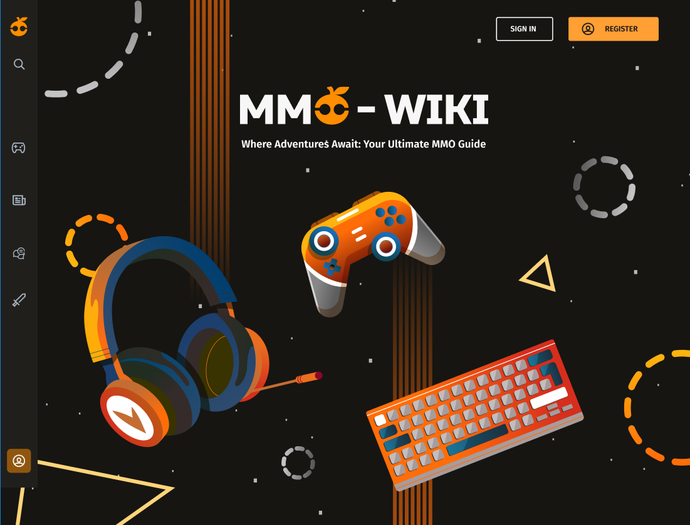

# Study Plan for MMO WIKI Website

This study plan serves as my personal notes for preparing to develop the MMO Wiki website for my client. It outlines a structured approach to learning, contributing, and enhancing the mmowiki website. Whether you're a new contributor or aiming to improve your development skills, this plan will guide you toward making valuable contributions to the project.

  

## my todolist

[MMO WIKI Development - Study Plan Checklist](https://www.notion.so/5eca9c77f59c417e8ed7735e0e9f064b?v=ce50432cc87a4f23b26afaf962d2e9af&pvs=4)

## useful links

[Bootstrap Cheat Sheet](https://getbootstrap.com/docs/5.0/examples/cheatsheet/)

[Next.js Leaflet Starter](https://next-leaflet-starter.netlify.app)

[TSM MAP](https://mapgenie.io/texas-chain-saw-massacre/maps/family-house)

[Gamer Guides](https://www.gamerguides.com/grounded/database)

[TanStack Table | React Table, Solid Table, Svelte Table, Vue Table](https://tanstack.com/table/v8)

[12 Good Tooltip Examples and Best Practices](https://userguiding.com/blog/tooltip-examples-best-practices/)

[Custom Tooltip CSS](https://stackoverflow.com/questions/10769016/display-image-on-text-link-hover-css-only)

[install composer](https://getcomposer.org)

[fix 'composer install' error](https://stackoverflow.com/questions/29318709/how-can-i-resolve-your-requirements-could-not-be-resolved-to-an-installable-set)

[Flex Cheat Sheet](https://flexbox.malven.co)

## youtube tutorial

[Top 10 Advanced CSS Responsive Design Concepts You Should Know](https://youtu.be/TUD1AWZVgQ8?si=rD2fjoWlsvZkHmqq)

[How to implement React Leaflet in Nextjs 13 (App Router)](https://youtu.be/OjfRMmLp8NM?si=mFDChsx2ITDtafB-)

[Bootstrap 5 Crash Course](https://youtu.be/Jyvffr3aCp0?si=Gc1rpns0q0fUI-WE)

[React Material UI Tutorial](https://www.youtube.com/playlist?list=PLC3y8-rFHvwh-K9mDlrrcDywl7CeVL2rO)

[TypeScript for React/Next.js Developers](https://youtu.be/WlxcujsvcIY?si=S8h428wc9Ow1wFD8)

[React TypeScript Tutorial for Beginners](https://www.youtube.com/playlist?list=PLC3y8-rFHvwi1AXijGTKM0BKtHzVC-LSK)

[Learn React Hooks - Simply Explained!](https://www.youtube.com/playlist?list=PLApy4UwQM3UrZsBTY111R6P4frt6WK-G2)

[How To Install Laravel For The First Time](https://youtu.be/2qgS_MCvDfk?si=OE-V-lT49Cnai9OL)

## udemy courses

[Modern React with Redux 2023 Update](https://www.udemy.com/course/react-redux/)

## tools

[css transform visualizer](https://css-transform.moro.es)

